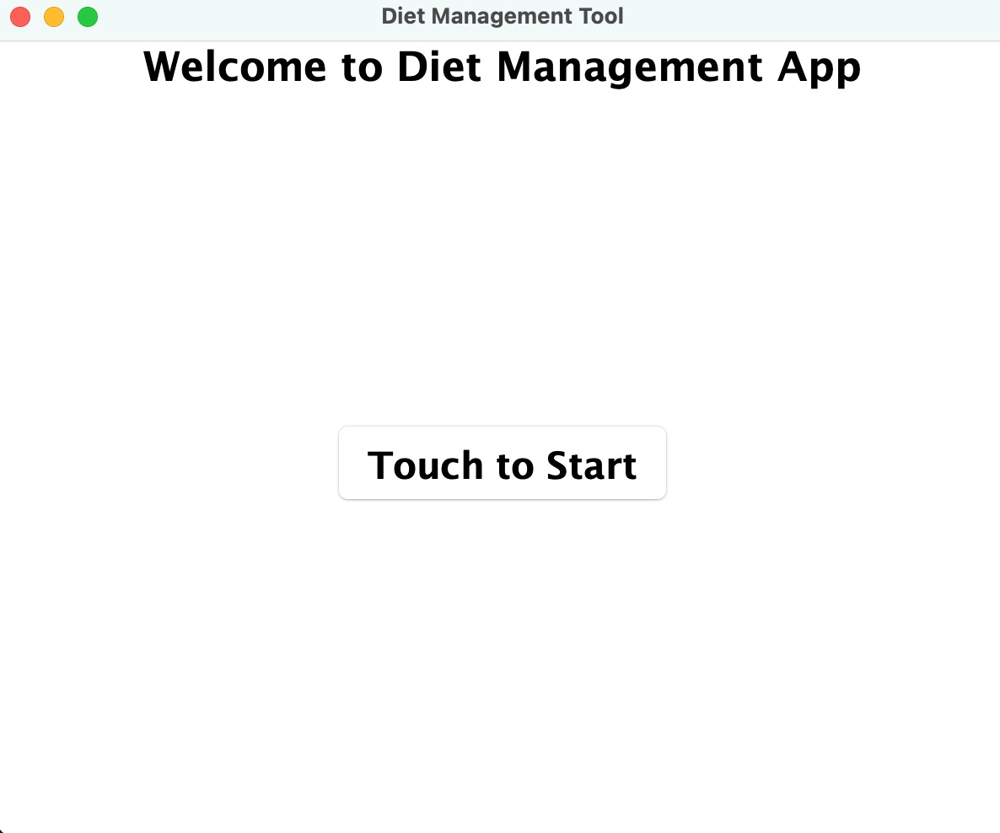
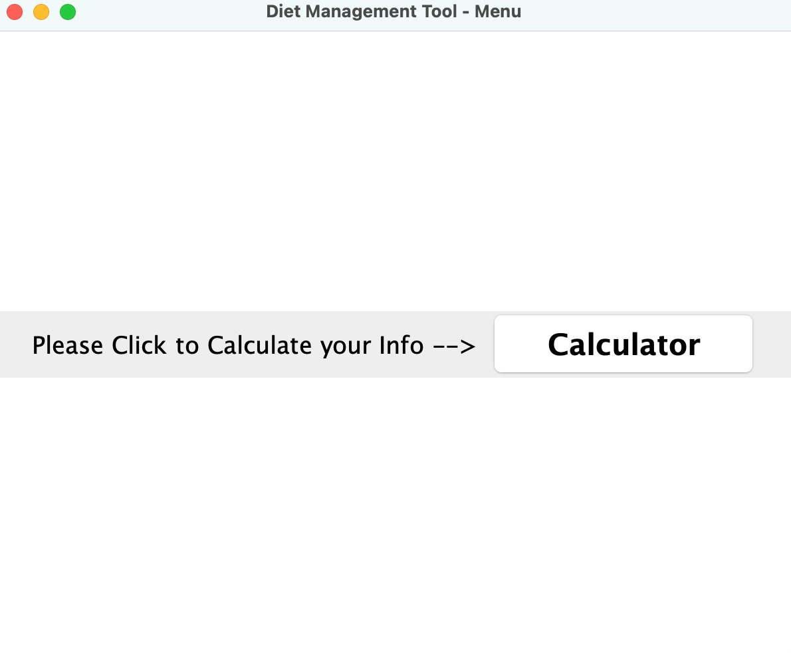
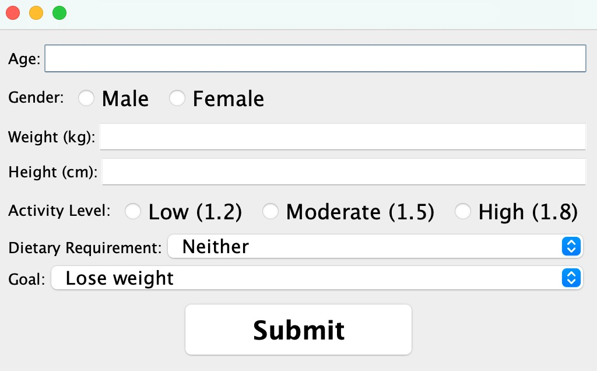
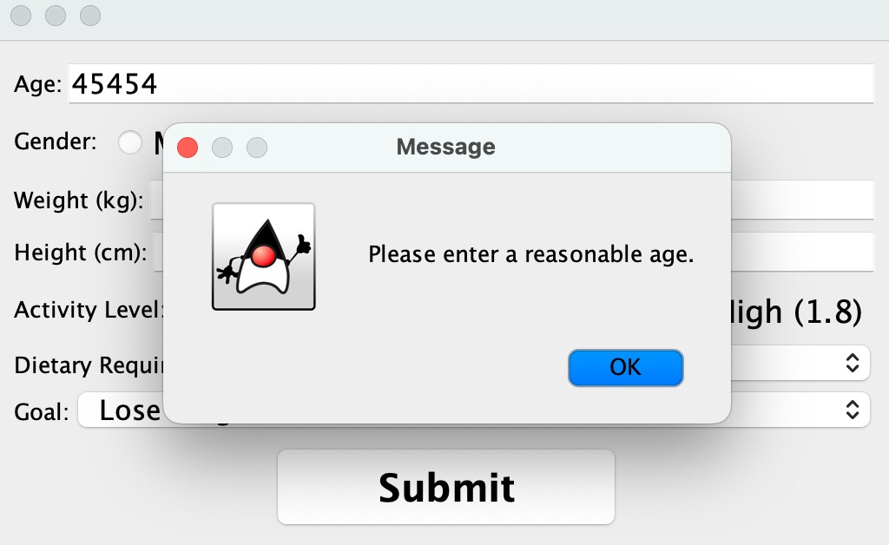
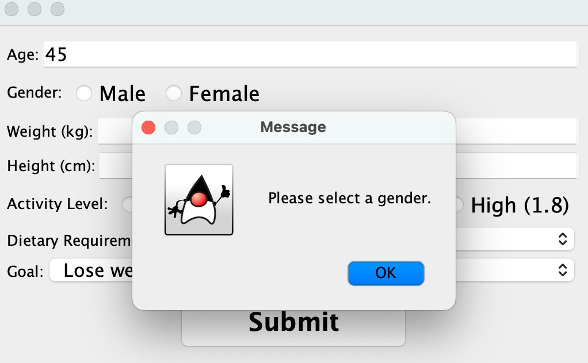
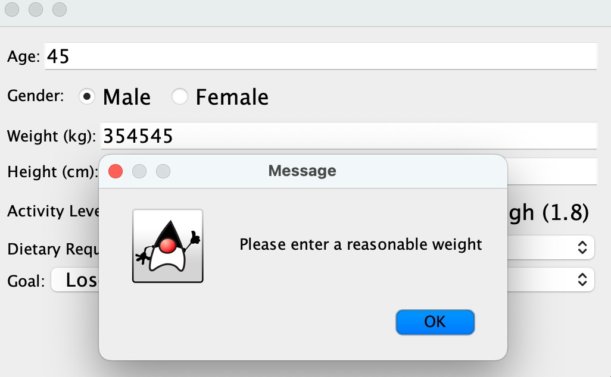
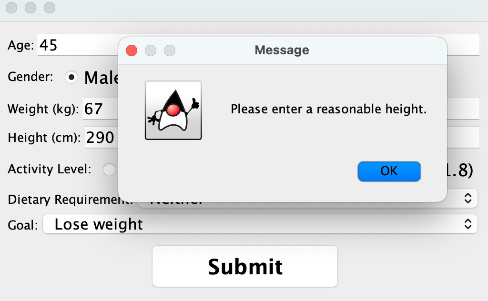
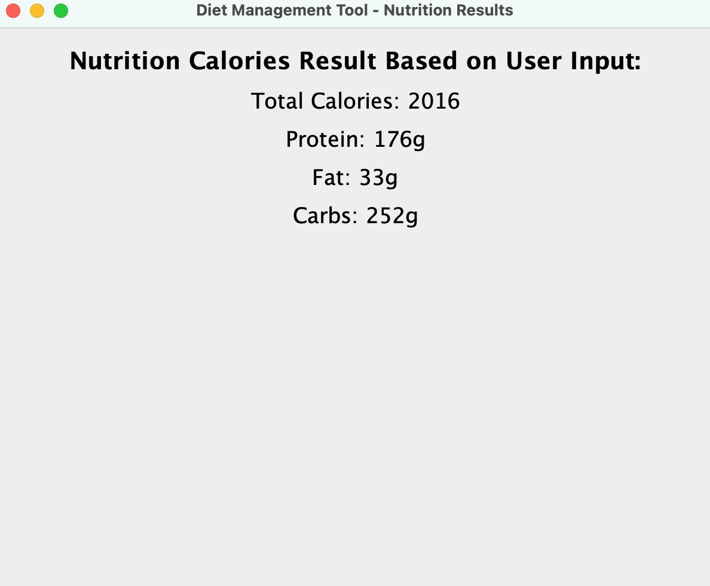

# Key Features and Future Developments

## Screenshots
### Welcome Screen

This is the home screen. Press start to start the application.

### Menu

This is the menu screen, the nutrition calculator can be accessed here. We aim to add other options as well.

### Calculator

This is the actual calculator screen.

### Invalid Input Handling
<table>
  <tr>
    <td>
    Various checks have been made to make sure the input data is valid. This is the age check.
    </td>
    <td>
    If a field is left empty, the program checks that as well. This is the gender check.</td>
  </tr>
  <tr>
    <td>
    
    The weight should be a reasonable value as well. This is the weight check.
    </td>
    <td>
    The height check. To ensure the user's height has a valid value.</td>
  </tr>
</table>

Once all the information is checked and verified, the screen is closed and the user data is saved. Press "OK" to move to the next screen.

### Nutrition Suggestion

After collecting the data, the nutrition calculator does its magic, voilà the calories and other stats are shown!

## Proud Achievements
We're overjoyed to share some of the standout features in our app that we are particularly proud of:

- **Welcome Screen**: A user-friendly landing page that effectively introduces the tool and its benefits, setting the stage for a seamless user experience.
- **User Information Collection**: Our app meticulously collects vital data such as age, weight, and dietary preferences to offer personalized suggestions.
- **Nutrition Suggestion System**: Provides custom dietary recommendations based on user-provided data.

We take immense pride in the progress we've made so far. While our Minimum Viable Product (MVP) is complete, we acknowledge that the user interface (UI) is not yet at its best. Enhancing the UI is crucial for a smooth user experience, and we are committed to making these improvements in our upcoming updates.

## Ongoing and Future Developments
### Areas of Ongoing Development
- **Linear Regression Analysis**: Currently in the development phase, this feature will present dietary trends and be dynamically updated based on real-time user data.
- **Interactive Food Intake Logging**: In development with future plans to incorporate a comprehensive food item list for meticulous tracking.

### Future Implementation Plans
- **Must-Have Features**: We plan to further enhance the Nutrition Suggestion System and complete the Interactive Food Intake Logging.
- **Optional Features**: Depending on our time and workload, we aim to implement additional functionalities like PDF report export, data persistence, and a custom meal planner.

Our journey so far has been filled with learning and growth. We remain dedicated to delivering an exceptional product that meets the needs and exceeds the expectations of our users.
